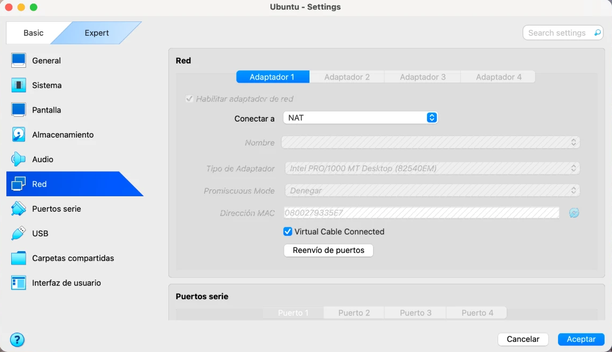
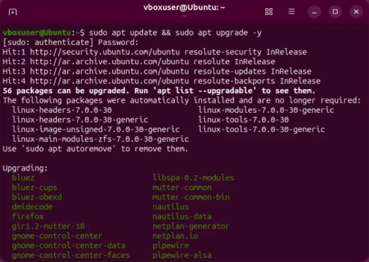
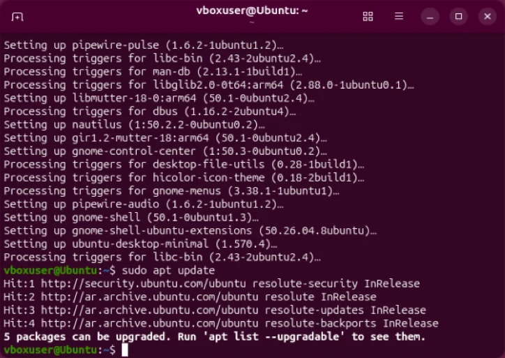
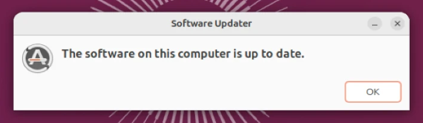
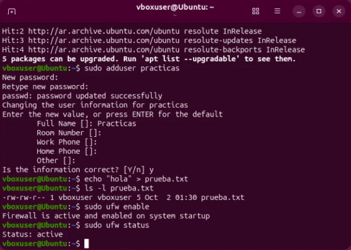
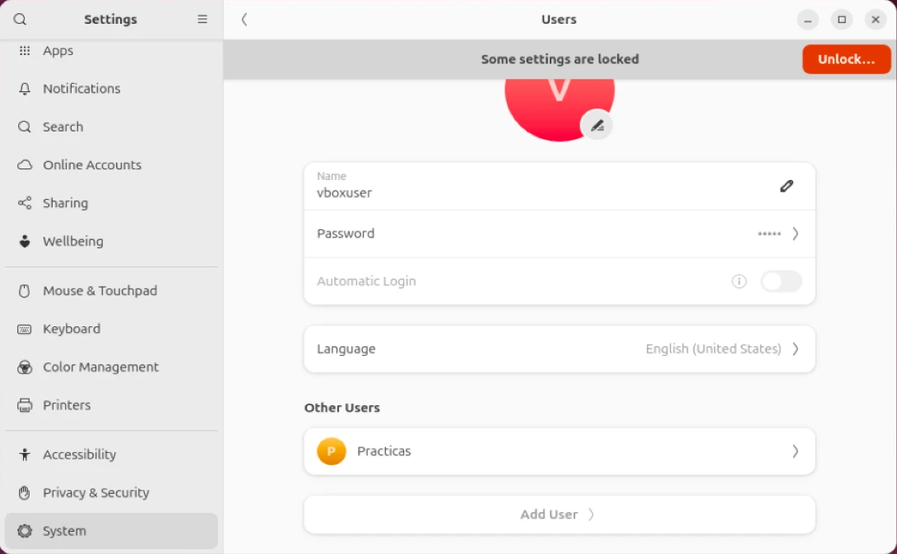
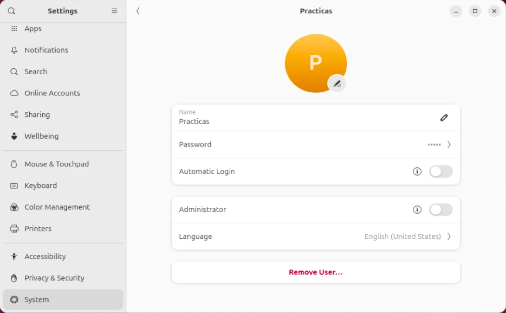
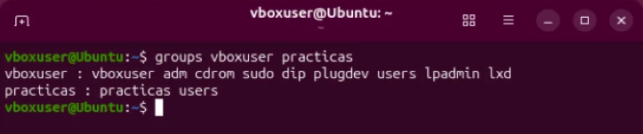
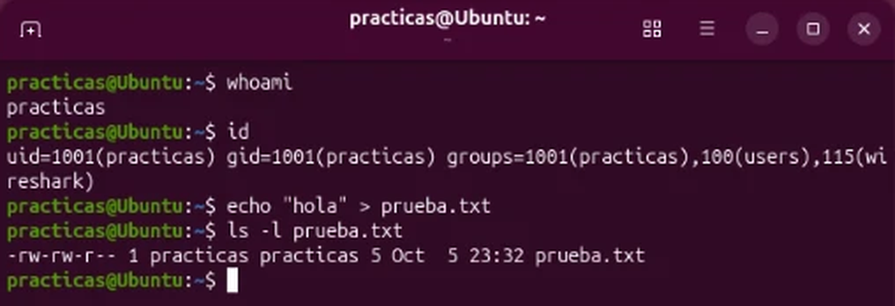
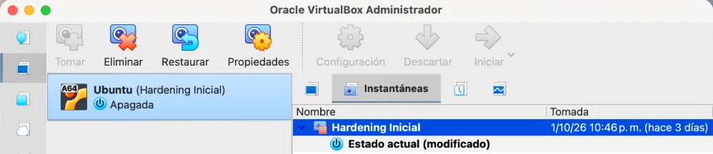

# Reporte Técnico de Configuración de Laboratorio

**Pre-entrega 2 · Checkpoint: Mi primer laboratorio seguro de ciberseguridad**

**Curso:** Ciberseguridad (diplomatura), Coderhouse  
**Alumno:** Agustín Idoyaga Molina  
**Fecha:** Octubre de 2026

## Resumen del entorno

| Componente | Configuración |
|---|---|
| Equipo anfitrión (host) | Mac con chip Apple M4 Pro (macOS) |
| Hipervisor | Oracle VirtualBox, versión para Apple Silicon |
| Sistema invitado | Ubuntu Desktop 26.04.1 LTS (ARM64) |
| Red de la VM | NAT |
| Usuarios | `vboxuser` (administrador) y `practicas` (estándar, sin privilegios) |
| Firewall | UFW activo |
| Snapshot | `Hardening Inicial` |

Elegí Ubuntu porque Linux es el sistema más usado en ciberseguridad. Como mi Mac tiene un procesador ARM (Apple Silicon), usé la imagen **ARM64** de Ubuntu: las imágenes para Intel/AMD (`amd64`) no pueden ejecutarse en VirtualBox sobre este chip.

La consigna permite trabajar con Windows o Linux. Los puntos de la "capa Windows" (usuario estándar y sistema actualizado) los resolví con sus equivalentes en Ubuntu.

## 1. La fundación: VirtualBox y red aislada

Configuré el adaptador de red de la máquina virtual en modo **NAT** (*Configuración → Red → Adaptador 1 → Conectar a: NAT*, Figura 1).

**Por qué elegí NAT y cómo protege a mi Mac:**

- **La VM queda escondida detrás del host.** VirtualBox le asigna una dirección de una red privada propia, distinta de la de mi Wi-Fi, y traduce sus conexiones hacia afuera (*Network Address Translation*). La VM puede salir a internet, pero ningún dispositivo de mi red puede iniciar una conexión hacia ella.
- **No hay servicios expuestos.** No configuré reenvío de puertos, así que nada de lo que corra dentro de la VM es accesible desde afuera.
- **Bridge habría sido riesgoso.** En modo Bridge la VM sería un equipo más de mi red doméstica, visible y alcanzable desde los demás dispositivos. Cuando instale herramientas de prueba, un error o un programa malicioso podría afectar a toda la red.
- **Red Interna aísla todavía más**, pero deja a la VM sin internet, y en esta etapa la necesitaba para descargar actualizaciones. NAT es el equilibrio entre aislamiento y conectividad.



*Figura 1. Adaptador de red de la VM conectado en modo NAT.*

## 2. Usuarios y actualizaciones

### 2.1 Sistema actualizado

Ejecuté `sudo apt update && sudo apt upgrade -y`:

- `apt update` descarga la lista de paquetes disponibles desde los repositorios oficiales de Ubuntu (incluido el de seguridad, `resolute-security`).
- `apt upgrade -y` instala las versiones nuevas. Había **56 paquetes desactualizados**, entre ellos Firefox, componentes del escritorio GNOME, Bluetooth (`bluez`) y audio (`pipewire`).



*Figura 2. Búsqueda e instalación de actualizaciones.*



*Figura 3. Final de la instalación y nueva consulta de paquetes.*

Al volver a consultar quedaban 5 paquetes pendientes (Figura 3). Completé la actualización con el Actualizador de software de Ubuntu, que confirmó que el sistema quedó al día.



*Figura 4. "The software on this computer is up to date": el sistema está actualizado.*

**Por qué es importante:** la mayoría de los ataques aprovechan vulnerabilidades que ya son conocidas y tienen parche. Una instalación nueva arrastra las actualizaciones publicadas desde que se generó la imagen, así que actualizar es el primer paso del hardening.

### 2.2 Usuario estándar para las prácticas

Separé la cuenta de administración de la cuenta de trabajo:

- **`vboxuser`** es la cuenta creada durante la instalación. Es **administradora**: puede usar `sudo`. La reservo para tareas de administración (instalar, actualizar, configurar).
- **`practicas`** es una cuenta nueva que creé con `sudo adduser practicas`. Por defecto, `adduser` no la agrega al grupo `sudo`, así que es una **cuenta estándar, sin privilegios**. Es la que voy a usar para los ejercicios.



*Figura 5. Creación del usuario `practicas` y activación del firewall, con la cuenta administradora. También se ve una primera prueba de `ls -l` hecha con `vboxuser`, que después repetí con `practicas` (Figura 9).*



*Figura 6. Panel de usuarios de Ubuntu: la cuenta principal `vboxuser` y la cuenta separada `Practicas`.*

En la configuración de la cuenta `Practicas`, el interruptor **Administrator** está desactivado (Figura 7). La terminal lo confirma (Figura 8): `vboxuser` pertenece al grupo `sudo`, mientras que `practicas` solo pertenece a sus grupos básicos (`practicas` y `users`).



*Figura 7. La cuenta `Practicas` no es administradora.*



*Figura 8. `groups vboxuser practicas`: solo `vboxuser` pertenece al grupo `sudo`.*

**Por qué es importante:** es el principio de mínimo privilegio. Trabajar siempre como administrador es el error más común del principiante: cualquier programa que ejecute hereda esos permisos. Si con la cuenta `practicas` corro una herramienta maliciosa o me equivoco con un comando, no puede instalar software ni modificar la configuración del sistema, así que el daño queda acotado.

## 3. Capa Linux: permisos y gestión

### 3.1 Permisos de archivos

La primera prueba la había hecho con `vboxuser` (Figura 5), y por eso el archivo quedaba a nombre del administrador. La repetí con la cuenta `practicas`, que es la que uso para los ejercicios (Figura 9):

```
$ whoami
practicas
$ echo "hola" > prueba.txt
$ ls -l prueba.txt
-rw-rw-r-- 1 practicas practicas 5 Oct  5 23:32 prueba.txt
```



*Figura 9. `whoami` confirma la cuenta `practicas`, y `ls -l` muestra que el archivo le pertenece a ella.*

| Parte | Valor | Significado |
|---|---|---|
| Tipo | `-` | Archivo común (una `d` indicaría un directorio) |
| Dueño | `rw-` | `practicas` puede leer y escribir |
| Grupo | `rw-` | Los miembros del grupo `practicas` (en Ubuntu, cada cuenta tiene su propio grupo) pueden leer y escribir |
| Otros | `r--` | El resto de los usuarios solo podría leerlo |

El resto de la línea indica la cantidad de enlaces (`1`), el dueño y el grupo (`practicas practicas`), el tamaño en bytes (`5`: "hola" más el salto de línea) y la fecha de modificación. Ningún grupo tiene permiso de ejecución (`x`), porque es un archivo de texto. Si fuera un archivo sensible, con `chmod 600 prueba.txt` lo dejaría accesible solo para su dueño. Como lo creé con `practicas`, el dueño es la cuenta de trabajo y no la administradora: los archivos de las prácticas quedan separados de la administración del sistema.

### 3.2 Gestión de paquetes desde la terminal

La búsqueda e instalación de actualizaciones con `sudo apt update` está documentada en la sección 2.1 (Figuras 2 a 4). Estos comandos requieren `sudo`, así que solo la cuenta administradora puede ejecutarlos. Como `practicas` no está en el grupo `sudo` (Figura 8), desde esa cuenta no se puede instalar ni actualizar software: es otra forma en que la separación de usuarios protege al sistema.

### 3.3 Hardening adicional: firewall

Activé el firewall de Ubuntu (Figura 5):

```
$ sudo ufw enable
Firewall is active and enabled on system startup
$ sudo ufw status
Status: active
```

Con su política por defecto, UFW **bloquea todas las conexiones entrantes** y permite las salientes. Junto con NAT forma una segunda capa de defensa: aunque en el futuro cambie la red a Bridge, la VM seguirá rechazando las conexiones que no inició ella misma.

## 4. La red de seguridad: snapshot inicial

Con la máquina virtual apagada, tomé una instantánea desde *Instantáneas → Tomar* con el nombre **`Hardening Inicial`** (Figura 10).



*Figura 10. Instantánea "Hardening Inicial" con la VM apagada.*

**Por qué es importante:** el snapshot guarda el estado completo del disco en este momento: sistema limpio, actualizado y con el hardening aplicado. Si un ejercicio rompe algo, si pruebo una herramienta que resulta peligrosa o si cambio una configuración por error, con *Restaurar* vuelvo a este punto en segundos, sin reinstalar. La tomé con la VM apagada para que el estado guardado sea consistente, sin procesos a medio ejecutar.

## 5. Conclusión

El laboratorio quedó listo para practicar de forma segura:

- **Aislado** de mi red doméstica gracias a NAT y al firewall.
- **Actualizado** con los últimos parches de seguridad.
- **Con mínimo privilegio:** una cuenta estándar para practicar, separada de la de administración.
- **Recuperable:** un snapshot para volver al estado limpio cuando lo necesite.

En el próximo módulo voy a usar esta máquina para capturar y analizar tráfico con Wireshark, sin exponer mi red real.

## Checklist de la consigna

| Requisito | Dónde está |
|---|---|
| Red en modo NAT o Red Interna, con explicación | Sección 1, Figura 1 |
| Usuario estándar separado del administrador | Sección 2.2, Figuras 6, 7 y 8 |
| Evidencia de sistema actualizado | Sección 2.1, Figuras 2, 3 y 4 |
| Permisos de un archivo con `ls -l` | Sección 3.1, Figura 9 |
| Búsqueda de actualizaciones con `sudo apt update` | Secciones 2.1 y 3.2 |
| Snapshot "Hardening Inicial" | Sección 4, Figura 10 |
