# Reporte de Análisis de Tráfico

**Pre-entrega 3 · Checkpoint: Análisis de tráfico e identificación de protocolos inseguros**

**Curso:** Ciberseguridad (diplomatura), Coderhouse  
**Alumno:** Agustín Idoyaga Molina  
**Fecha:** Octubre de 2026

## 1. Introducción

El objetivo de esta práctica es capturar con Wireshark el tráfico que genera una navegación web, identificar los protocolos que intervienen, distinguir las comunicaciones seguras de las inseguras y entender cómo viaja la información por la red.

Hice la captura en el laboratorio armado en la pre-entrega 2, en lugar de hacerla directamente en mi Mac. Así el tráfico queda aislado de mi equipo real y la captura sale más limpia: tiene menos ruido de fondo y no incluye datos personales.

| Componente | Detalle |
|---|---|
| Equipo | Máquina virtual Ubuntu 26.04.1 LTS (ARM64) en VirtualBox |
| Red | NAT, interfaz `enp0s8`, dirección IP `10.0.2.15` |
| Herramienta | Wireshark, ejecutado con la cuenta estándar `practicas` |
| Sitios visitados | `http://neverssl.com` (HTTP) y `https://www.wikipedia.org` (HTTPS) |
| Archivo de captura | `captura-pe3.pcapng`: 38.721 paquetes en unos 2 minutos (≈34 MB) |

**Captura sin privilegios de administrador.** Instalé Wireshark con la cuenta administradora (`vboxuser`) y agregué a `practicas` al grupo `wireshark`. Ese grupo solo habilita la captura de paquetes. Ejecutar Wireshark como `root` es riesgoso, porque sus analizadores procesan datos que llegan de la red: si uno tuviera una falla, un paquete malicioso podría aprovecharla con permisos totales. Así mantengo el principio de mínimo privilegio de la pre-entrega 2.

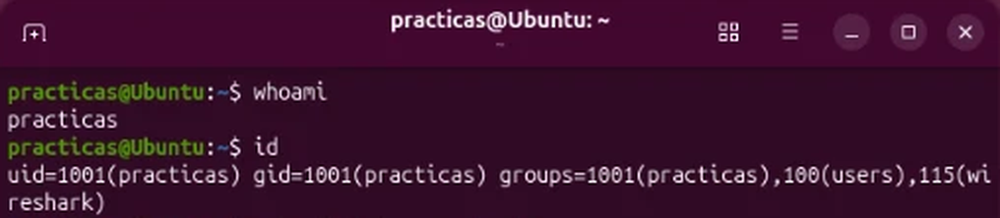

*Figura 1. La cuenta `practicas` (sin privilegios de administrador) pertenece al grupo `wireshark`.*

## 2. Captura de tráfico

Con la captura en marcha sobre `enp0s8`, entré a `http://neverssl.com`, después a `https://www.wikipedia.org`, esperé aproximadamente un minuto y detuve la captura.

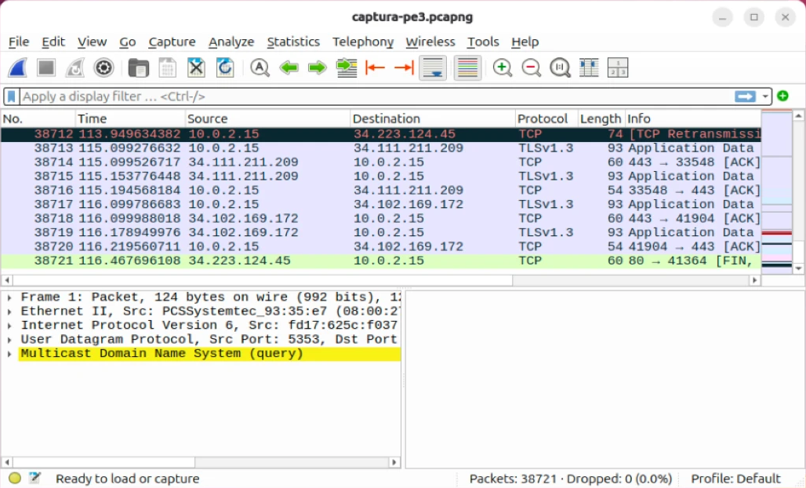

*Figura 2. Vista general de la captura: 38.721 paquetes, con tráfico TCP y TLSv1.3.*

## 3. Inventario de protocolos

Para el inventario usé *Statistics → Protocol Hierarchy* sin ningún filtro aplicado, que resume todos los protocolos presentes en la captura.

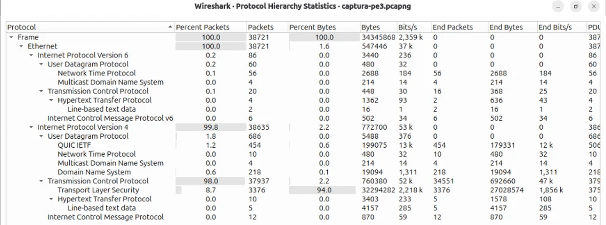

*Figura 3. Jerarquía de protocolos de toda la captura.*

| Protocolo | Capa | Paquetes | Función | Seguridad |
|---|---|---|---|---|
| Ethernet | Enlace | 38.721 | Transporta las tramas dentro de la red local | No cifra (transporte) |
| IPv4 / IPv6 | Red | 38.635 / 86 | Direcciona los paquetes entre equipos | No cifra (transporte) |
| TCP | Transporte | 37.957 | Conexiones confiables: handshake, orden y retransmisión | No cifra (transporte) |
| UDP | Transporte | 746 | Envío rápido sin conexión | No cifra (transporte) |
| **TLS** | Aplicación | 3.376 | Cifra el tráfico HTTPS. Concentra el **94% de los bytes** | **Seguro** |
| **QUIC** | Transporte / Aplicación | 454 | Base de HTTP/3, cifrado con TLS 1.3 sobre UDP | **Seguro** |
| **DNS** | Aplicación | 218 | Traduce nombres de dominio a direcciones IP | **Inseguro**: viaja en texto plano |
| **HTTP** | Aplicación | 14 | Navegación web sin cifrar | **Inseguro**: todo es legible |
| NTP | Aplicación | 66 | Sincroniza la hora del sistema | **Inseguro**: sin cifrado ni autenticación |
| mDNS | Aplicación | 8 | Descubre equipos y servicios en la red local | **Inseguro**: anuncia datos del equipo |
| ICMP / ICMPv6 | Red (control) | 12 / 6 | Mensajes de control y error (por ejemplo, ping) | No cifra, pero no lleva datos del usuario |

IP, TCP y UDP no cifran por sí mismos: la seguridad depende del protocolo de aplicación que transportan. La mayor parte del volumen viajó cifrado (TLS y QUIC). Lo que quedó expuesto es una porción chica en bytes, pero muy reveladora: las **consultas DNS** muestran qué sitios visito y el **HTTP** muestra el contenido completo.

## 4. Análisis DNS

Con el filtro `dns` (refinado a `dns.qry.name == "neverssl.com"` para aislar la consulta) busqué la resolución del sitio HTTP.

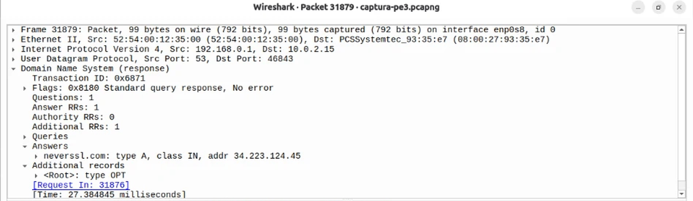

*Figura 4. Respuesta DNS (paquete 31879): `neverssl.com: type A, class IN, addr 34.223.124.45`.*

- **Dominio que resolvió el navegador:** `neverssl.com`
- **Dirección IP obtenida:** `34.223.124.45` (registro de tipo A, IPv4)

La consulta salió en el paquete 31876 y la respuesta (31879) llegó en **27 ms** desde el servidor DNS de mi red, `192.168.0.1`. El navegador también pidió la dirección IPv6 (registro AAAA), pero se conectó por IPv4: 7 ms después de la respuesta ya enviaba el primer paquete a `34.223.124.45`.

**Observación de seguridad:** la consulta y la respuesta viajan sin cifrar. Cualquiera que observe la red puede saber qué dominios visito, aunque después la navegación sea por HTTPS.

## 5. Tráfico HTTP

Con el filtro `http` ubiqué la petición a neverssl.com (paquete 31904) y desplegué su detalle.

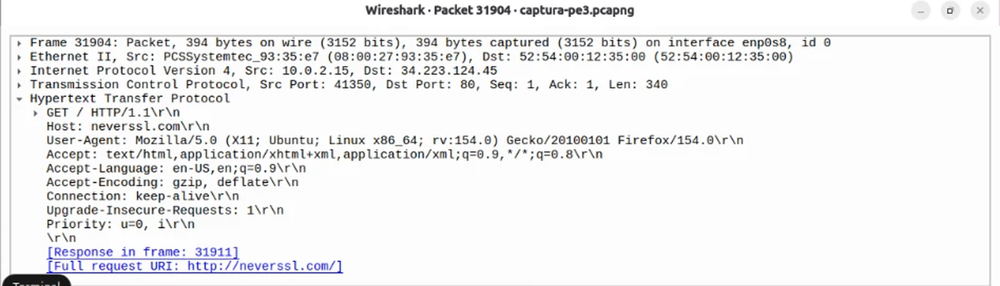

*Figura 5. Petición HTTP a neverssl.com con todos sus campos visibles.*

| Campo | Valor observado |
|---|---|
| Método | `GET` |
| Host | `neverssl.com` |
| URI solicitada | `/` (URL completa: `http://neverssl.com/`) |
| Código de respuesta | `200 OK` (paquete 31911) |

Con *Follow → HTTP Stream* se reconstruye la conversación completa en texto plano: en rojo la petición del navegador y en azul la respuesta del servidor.

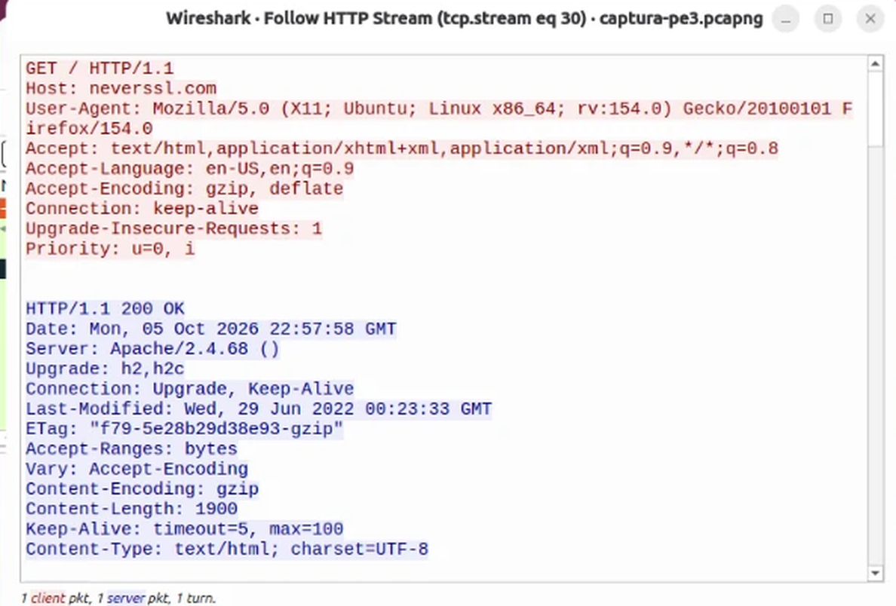

*Figura 6. Conversación HTTP completa: petición (rojo) y respuesta `HTTP/1.1 200 OK` (azul).*

Toda la comunicación es legible. Se ve la URL, el navegador y el sistema operativo (`Firefox/154.0`, `Ubuntu`), el idioma configurado (`en-US`), el software del servidor (`Apache/2.4.68`), las fechas y el contenido de la página. Además de neverssl, aparecieron peticiones HTTP de Firefox a `detectportal.firefox.com` (`/success.txt`, `/canonical.html`). Son comprobaciones automáticas de conexión que también viajan sin cifrar.

## 6. Tráfico HTTPS

Con el filtro `tls` se ven las conexiones cifradas. Casi todos los paquetes figuran como *Application Data*: Wireshark sabe que hay datos, pero no puede interpretarlos.

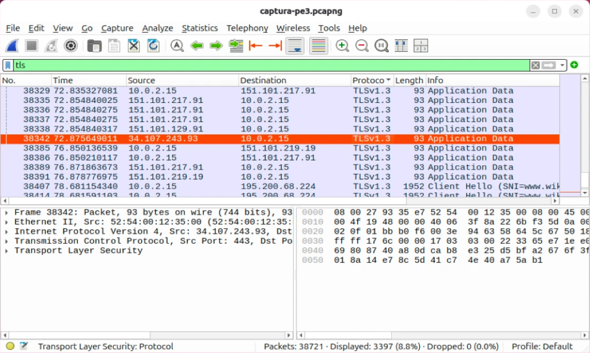

*Figura 7. Filtro `tls`: paquetes *Application Data* cifrados y, al final, el *Client Hello* hacia Wikipedia.*

La conexión a Wikipedia empieza con un *Client Hello* de **TLS 1.3** (paquete 38407) hacia `195.200.68.224`, puerto **443**. En ese saludo inicial el navegador ofrece algoritmos de cifrado, y a partir de la respuesta del servidor todo viaja cifrado.

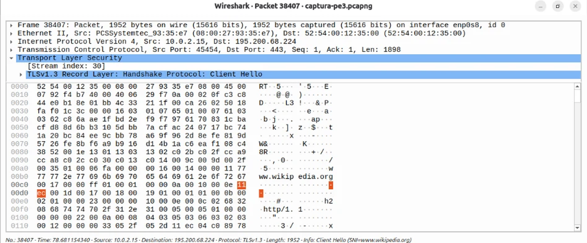

*Figura 8. Client Hello de TLS 1.3: el nombre `www.wikipedia.org` (SNI) todavía se lee en los bytes.*

Al intentar reconstruir la conversación con *Follow → TCP Stream*, el resultado es ilegible.

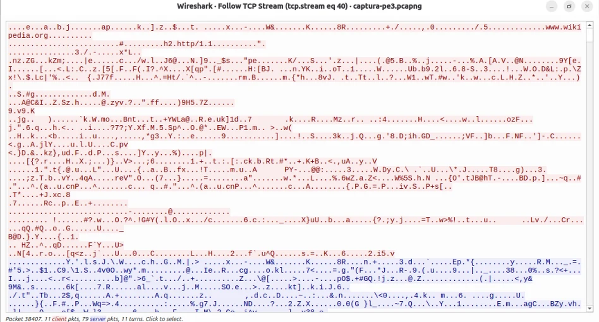

*Figura 9. La misma conexión reconstruida: 84 kB de datos cifrados, ilegibles.*

**¿Qué diferencias hay respecto del tráfico HTTP?**

| | HTTP (neverssl.com) | HTTPS (wikipedia.org) |
|---|---|---|
| Puerto | 80 | 443 |
| Antes de los datos | Solo el handshake TCP | Handshake TCP y negociación TLS (Client Hello / Server Hello) |
| Método, URL y cabeceras | Visibles | Cifrados |
| Contenido de la página | Legible | Ilegible (*Application Data*) |
| Dominio | Visible (`Host`) | Visible solo en el saludo inicial (SNI) |
| Identidad del servidor | No se verifica | Se verifica con un certificado |

**¿Es posible leer el contenido de la página?** No. Solo quedan visibles los **metadatos**: las direcciones IP, los puertos, el tamaño y el horario de los paquetes, y el nombre del sitio en el SNI (`www.wikipedia.org`). Alguien que espíe la red puede saber que entré a Wikipedia, pero no qué artículo leí ni qué escribí.

## 7. Three-Way Handshake

Con el filtro `tcp.flags.syn == 1` se ven los paquetes que abren conexiones TCP.

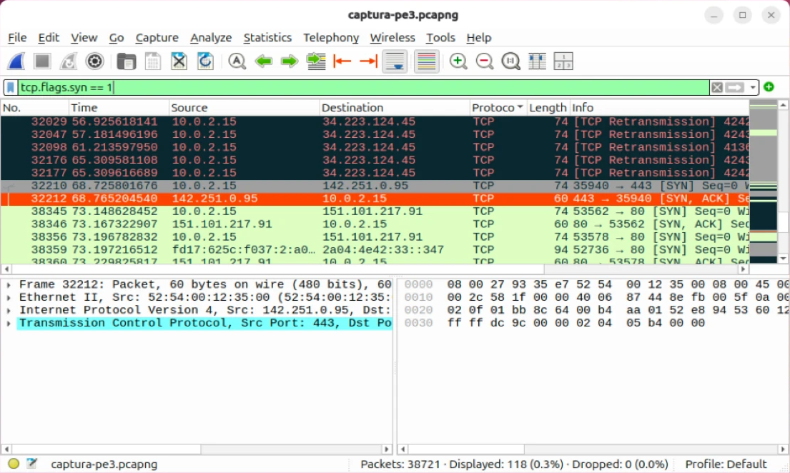

*Figura 10. Filtro `tcp.flags.syn == 1`: aparecen los pares SYN / SYN, ACK, pero no el ACK final.*

Este filtro muestra solo los dos primeros paquetes de cada handshake, porque el tercero (ACK) ya no tiene activado el flag SYN. Para ver el handshake completo filtré la conexión a neverssl.com con `tcp.stream eq 30`.

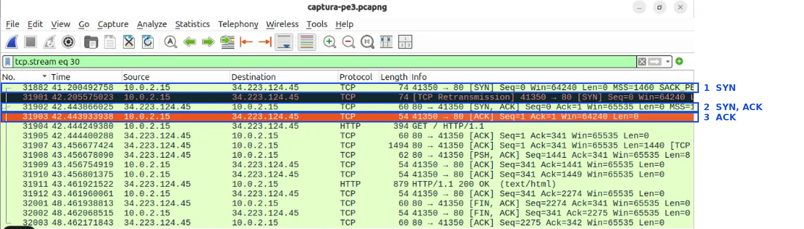

*Figura 11. Conexión a neverssl.com (`tcp.stream eq 30`), con los tres paquetes del handshake marcados.*

| # | Paquete | Dirección | Flags | Función |
|---|---|---|---|---|
| 1 | 31882 | VM → servidor (puerto 41350 → 80) | `SYN` | Pide abrir la conexión y propone su número de secuencia inicial y sus parámetros (ventana de 64240 bytes, MSS de 1460) |
| 2 | 31902 | Servidor → VM | `SYN, ACK` | Acepta: confirma el SYN recibido (`Ack=1`) y envía su propio número de secuencia |
| 3 | 31903 | VM → servidor | `ACK` | Confirma la respuesta del servidor (`Ack=1`). La conexión queda establecida |

Inmediatamente después (paquete 31904) viaja el `GET /` y en el 31911 llega el `200 OK`. A los 48 segundos la conexión se cierra de forma ordenada con paquetes `FIN, ACK` de ambos lados.

En esta conexión, el primer SYN (41,20 s) no recibió respuesta a tiempo y TCP lo **reenvió** un segundo después (paquete 31901, *TCP Retransmission*). El SYN, ACK llegó a los 42,44 s. Esto muestra en acción el mecanismo de confiabilidad de TCP. En la Figura 10 se ven otras retransmisiones de SYN de intentos que tampoco tuvieron respuesta inmediata.

Los números `Seq=0` y `Ack=1` son relativos: Wireshark los muestra así para facilitar la lectura. En realidad cada extremo elige un número inicial aleatorio, lo que dificulta que un atacante falsifique o secuestre la conexión.

## 8. Análisis de seguridad

**¿Por qué HTTP es considerado un protocolo inseguro?** Porque no ofrece ninguna de las tres propiedades de la tríada CIA vista en la pre-entrega 1:

- **Confidencialidad:** todo viaja en texto plano, así que cualquiera en el camino (la misma red Wi-Fi, el router o el proveedor) puede leerlo.
- **Integridad:** nada impide que un intermediario modifique la página en tránsito, por ejemplo para insertar publicidad o código malicioso.
- **Autenticidad:** el navegador no puede verificar que esté hablando con el servidor real.

**¿Qué información pudo observarse en la captura HTTP?** El dominio y la URL completa (`http://neverssl.com/`), el método (`GET`), el navegador y su versión (`Firefox 154`), el sistema operativo (`Ubuntu`), el idioma (`en-US`), el código de respuesta (`200 OK`), el software del servidor (`Apache/2.4.68`) y el contenido de la página. Si el sitio tuviera un formulario de inicio de sesión, el usuario y la contraseña se verían exactamente igual.

**¿Qué ventajas ofrece HTTPS?** Cifra la comunicación, de modo que el contenido es ilegible para terceros (confidencialidad). Detecta cualquier modificación en tránsito (integridad). Verifica con un certificado que el servidor es quien dice ser (autenticidad). En la captura se comprobó: de la conexión a Wikipedia solo se pudieron ver metadatos.

**¿Cómo protegería una VPN este tipo de comunicación?** Una VPN crea un túnel cifrado entre mi equipo y el servidor de la VPN. Quien observe mi red local solo vería tráfico cifrado hacia ese servidor: no podría leer el HTTP de neverssl, ni las consultas DNS, ni el nombre del sitio en el SNI, ni siquiera las direcciones IP de destino. Tiene límites: entre el servidor de la VPN y el sitio web, el HTTP vuelve a viajar sin cifrar, y el proveedor de la VPN puede ver ese tráfico. Por eso una VPN **complementa** a HTTPS, pero no lo reemplaza.

## 9. Conclusiones y recomendaciones

**Conclusiones:**

- La mayor parte del tráfico de una navegación actual viaja cifrado: TLS y QUIC concentraron casi el 95% de los bytes capturados.
- El tráfico que queda sin cifrar es poco, pero muy revelador. Con HTTP se pudo leer la comunicación completa, y con DNS se ve qué sitios se visitan.
- Incluso con HTTPS quedan metadatos visibles: el nombre del sitio (SNI), las direcciones IP y el volumen de datos.
- El three-way handshake se observó completo (SYN, SYN-ACK, ACK), junto con una retransmisión que muestra cómo TCP garantiza la entrega.

**Recomendaciones:**

1. **Activar el modo "Solo HTTPS"** del navegador (en Firefox: *Settings → Privacy & Security → HTTPS-Only Mode*), para que nunca cargue sitios sin cifrar sin avisar.
2. **Usar DNS cifrado** (DNS over HTTPS), para que las consultas no revelen los sitios visitados a la red local.
3. **Usar una VPN en redes públicas** (bares, aeropuertos, hoteles), donde no se puede confiar en quién más está conectado.
4. **No ingresar datos personales ni contraseñas en sitios HTTP.** Verificar siempre el candado y la dirección `https://`.
5. **Capturar tráfico solo en redes propias o con autorización,** y con una cuenta sin privilegios, como se hizo en esta práctica.

## Checklist de la consigna

| Requisito | Dónde está |
|---|---|
| Introducción | Sección 1, Figura 1 |
| Captura de tráfico (neverssl.com y wikipedia.org) | Sección 2, Figura 2 |
| Inventario de protocolos (al menos 4) | Sección 3, Figura 3 |
| Identificación de protocolos seguros e inseguros | Sección 3, tabla del inventario |
| Análisis DNS: dominio e IP obtenida | Sección 4, Figura 4 |
| Tráfico HTTP: método, host, URI y código de respuesta | Sección 5, Figuras 5 y 6 |
| Tráfico HTTPS: diferencias y si se puede leer el contenido | Sección 6, Figuras 7, 8 y 9 |
| Three-Way Handshake: SYN, SYN-ACK, ACK y su función | Sección 7, Figuras 10 y 11 |
| Análisis de seguridad (preguntas de la Parte 7) | Sección 8 |
| Conclusiones y recomendaciones | Sección 9 |
